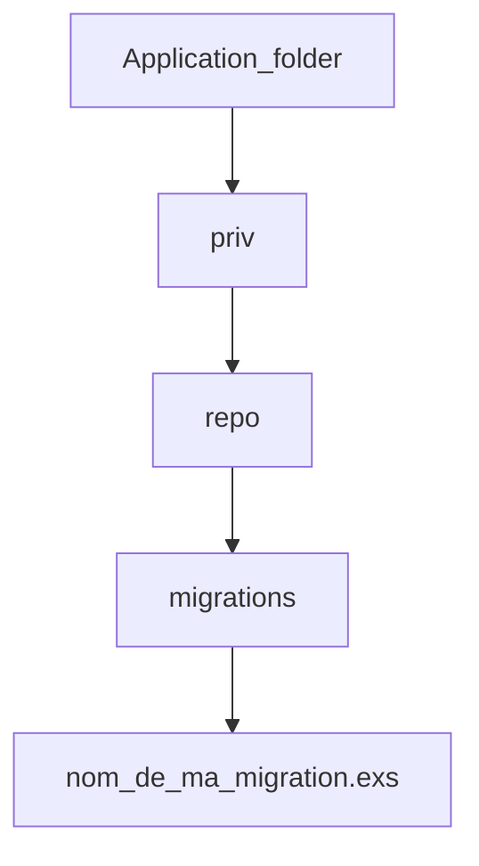

# Ecto notebook
[Accueil](README.md)
## Migration

Pour la création d'une table, nous allons créér un fichier de migration

```elixir
mix(ecto.gen.migration(nom_de_ma_migration))
```

<!-- Learn more at https://mermaid-js.github.io/mermaid -->



<!-- livebook:{"break_markdown":true} -->

Editons le fichier de migration, en exemple nous allons créer une table :users

# Ecto notebook

## Migration

Pour la création d'une table, nous allons créér un fichier de migration

```elixir
mix(ecto.gen.migration(nom_de_ma_migration))
```

<!-- Learn more at https://mermaid-js.github.io/mermaid -->


<!-- livebook:{"break_markdown":true} -->

Editons le fichier de migration, en exemple nous allons créer une table :users

```elixir
defmodule Gestiup.Repo.Migrations.CreateUsersAuthTables do
  use Ecto.Migration

  # Création avec un id par défaut soit en big_int (1...n)
  def change do
    create table(:users, primary_key: false) do
      add(:id, :binary_id, primary_key: true)
      add(:email, :citext, null: false)
      add(:hashed_password, :string, null: false)
      add(:confirmed_at, :naive_datetime)
      timestamps()
    end
  end
end
```

```elixir
defmodule Gestiup.Repo.Migrations.CreateUsersAuthTables do
  use Ecto.Migration

  # Création avec un id défini, ici en binary_id (uuid)
  def change do
    create table(:users, primary_key: false) do
      add(:id, :binary_id, primary_key: true)
      add(:email, :citext, null: false)
      add(:hashed_password, :string, null: false)
      add(:confirmed_at, :naive_datetime)
      timestamps()
    end
  end
end
```

Executer la migration

```elixir
mix(ecto.migrate)
```


<!-- livebook:{"break_markdown":true} -->

Ajout d'un champ name à notre table :users

```elixir
defmodule Gestiup.Repo.Migrations.AddUsersName do
  use Ecto.Migration

  def change do
    alter table(:users) do
      add(:name, :string)
    end
  end
end
```

Modifier le nom d'un champ

```elixir
defmodule Gestiup.Repo.Migrations.AddUsersName do
  use Ecto.Migration

  def change do
    alter table(:users) do
      rename(:name, to: :nom)
    end
  end
end
```

Supprimer un champ

```elixir
defmodule Gestiup.Repo.Migrations.AddUsersName do
  use Ecto.Migration

  def change do
    alter table(:users) do
      remove(:nom)
    end
  end
end
```

## Seeds (peupler une table)

Simple fichier de script .EXS

```elixir
alias MonProjet.Tvas
alias MonProjet.Tvas.Tva

# Repo.delete_all(Tvas)
MonProjet.Repo.delete_all(Tva)

Tvas.create_tva(%{
  label: "Taux à 20%",
  taux: 20.0,
  main: true,
  is_not_deletable: true,
  is_deleted: false
})

Tvas.create_tva(%{
  label: "Taux à 10%",
  taux: 10.0,
  main: true,
  is_not_deletable: true,
  is_deleted: false
})

Tvas.create_tva(%{
  label: "Taux à 0%",
  taux: 0.0,
  main: true,
  is_not_deletable: true,
  is_deleted: false
})

Tvas.create_tva(%{
  label: "Taux à 8.5% DOM-TOM",
  taux: 8.5,
  main: true,
  is_not_deletable: true,
  is_deleted: false
})
```

Pour l'exécuter, une simple commande mix dans le CLI

```elixir
mix(run(priv / repo / seeds_tva.exs))
```

Il est possible de regrouper les fichiers de peuplement dans les aliases du fichier mix.exs, par exemple :

```elixir
defp aliases do
  [
    setup: ["deps.get", "ecto.setup", "assets.setup", "assets.build"],
    "ecto.setup": ["ecto.create", "ecto.migrate", "run priv/repo/seeds.exs"],
    "ecto.reset": ["ecto.drop", "ecto.setup"],
    test: ["ecto.create --quiet", "ecto.migrate --quiet", "test"],
    # Ajout de mes fichiers de peuplement dans les aliases 
    seeds: [
      "run priv/repo/seeds_users.exs",
      "run priv/repo/seeds_tva.exs"
    ]
  ]
end
```

Pour exécuter les scripts :

```elixir
mix(seeds)
```

Une approche pour peupler depuis le code, par exemple ici, nous allons effacer les données de la table Tvas et la peupler avec des valeurs par défaut

```elixir
defmodule MonPojet.MySeedsTva do
  alias MonProjet.Repo
  alias MonProjet.Tvas
  alias MonProjet.Tvas.Tva

  def run() do
    Repo.delete_all(Tva)

    Tvas.create_tva(%{
      label: "Taux à 20%",
      taux: 20.0,
      main: true,
      is_not_deletable: true,
      is_deleted: false
    })

    Tvas.create_tva(%{
      label: "Taux à 10%",
      taux: 10.0,
      main: false,
      is_not_deletable: true,
      is_deleted: false
    })

    Tvas.create_tva(%{
      label: "Taux à 0%",
      taux: 0.0,
      main: false,
      is_not_deletable: true,
      is_deleted: false
    })

    Tvas.create_tva(%{
      label: "Taux à 8.5% DOM-TOM",
      taux: 8.5,
      main: false,
      is_not_deletable: true,
      is_deleted: false
    })
  end
end
```

il suffit alors d'appeler la fonction run(), par exemple depuis une page liveView

```elixir
def handle_event("task_exec", _, socket) do
  MonProjet.MySeedsTva.run()
  {:noreply, socket}
end
```