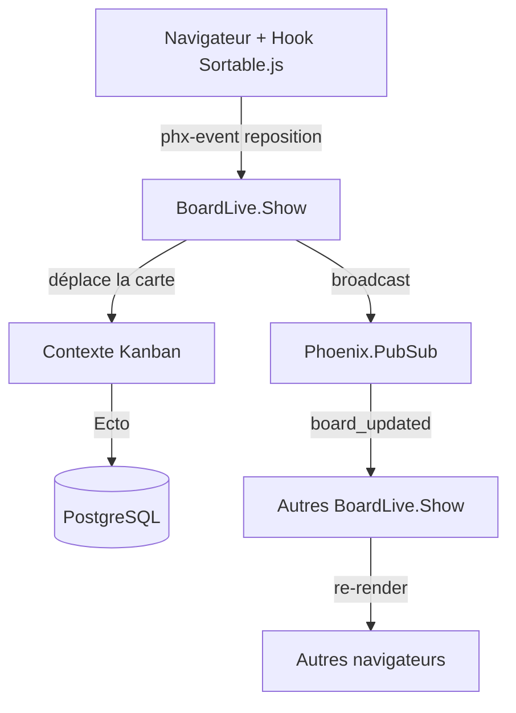

[Accueil](../README.md) · [🧭 Parcours d'apprentissage](../PARCOURS.md)

# 🗂️ Projet fil rouge — Kanban collaboratif temps réel

> 🟡→🔴 Projet guidé · **Objectif** : construire, étape par étape, un tableau Kanban (type Trello) où plusieurs personnes déplacent des cartes en **drag & drop**, avec **synchronisation temps réel** entre tous les navigateurs.
>
> Ce projet est le **fil rouge** qui relie tout le parcours : chaque étape réutilise une notion vue dans les notebooks.

## Pourquoi ce projet ?

- Il montre **l'argument massue de Phoenix** : le temps réel multi-utilisateur, presque sans JavaScript.
- Il **réutilise tes acquis** : ton Hook [Sortable.js](https://github.com/nseaSeb/SortableBoilerPlate) pour le drag & drop, et le [doctest `reposition`](../Test_unitaire/testUnitaireDansLeCommentaire.md) que tu as déjà écrit.
- Il se **découpe proprement** : logique pure → Ecto → tests → LiveView → temps réel → (bonus OTP).

## Ce qu'on construit

```
  BOARD : "Sprint 23"
  +------------+   +------------+   +------------+
  |  À faire   |   |  En cours  |   |  Terminé   |
  +------------+   +------------+   +------------+
  | [#12 Login]|   | [#07 API ] |   | [#03 CI  ] |
  | [#15 Docs ]|   |            |   | [#05 Logo] |
  +------------+   +------------+   +------------+
        ↑ je déplace une carte → tous les autres écrans bougent en direct
```

## Architecture (vue d'ensemble)



Trois schémas Ecto : **Board** (le tableau) → **Column** (les colonnes) → **Card** (les cartes). Une LiveView par tableau, abonnée à un sujet PubSub `board:<id>`.

---

# Étape 0 — Créer le projet

> 🛠️ Prérequis : Elixir + Phoenix installés ([guide](https://hexdocs.pm/phoenix/installation.html)), PostgreSQL en route.

```bash
mix phx.new kanban
cd kanban
mix ecto.create
```

Lance le serveur pour vérifier : `mix phx.server` → http://localhost:4000.

---

# Étape 1 — La logique pure (🟢 rappel : [Immutabilité & pattern matching](../Bases/immutabilite_et_pattern_matching.livemd), [Enum](../Bases/enum_stream_comprehensions.livemd))

Avant toute base de données, on isole **le cœur métier dans une fonction pure** : déplacer une carte d'une position à une autre dans une liste. Pur = pas d'effet de bord, donc trivial à tester.

`lib/kanban/ordering.ex` :

```elixir
defmodule Kanban.Ordering do
  @moduledoc "Logique pure de réordonnancement, sans base de données."

  @doc """
  Déplace l'élément d'index `from` vers l'index `to` dans une liste.

  ## Exemples

      iex> Kanban.Ordering.move(["a", "b", "c"], 0, 2)
      ["b", "c", "a"]

      iex> Kanban.Ordering.move(["a", "b", "c"], 2, 0)
      ["c", "a", "b"]

      iex> Kanban.Ordering.move(["a", "b", "c"], 1, 1)
      ["a", "b", "c"]
  """
  def move(liste, from, to) do
    element = Enum.at(liste, from)

    liste
    |> List.delete_at(from)
    |> List.insert_at(to, element)
  end
end
```

C'est exactement l'esprit de ton doctest `reposition` — mais isolé du LiveView, donc réutilisable et testable seul.

---

# Étape 2 — Modéliser avec Ecto (🟡 rappel : [Ecto](../Ecto.md), [Ecto avancé](../EctoAvance.md))

On génère les schémas et le contexte `Kanban`. Le contexte est la **frontière** entre le métier et le web (un principe central de Phoenix).

```bash
mix phx.gen.context Kanban Board boards name:string
mix phx.gen.context Kanban Column columns name:string position:integer board_id:references:boards
mix phx.gen.context Kanban Card cards title:string position:integer column_id:references:columns
mix ecto.migrate
```

Déclare les associations dans les schémas. Exemple `lib/kanban/kanban/column.ex` :

```elixir
schema "columns" do
  field :name, :string
  field :position, :integer
  belongs_to :board, Kanban.Board
  has_many :cards, Kanban.Card, preload_order: [asc: :position]
  timestamps()
end
```

Et une fonction de chargement complète dans le contexte `lib/kanban/kanban.ex` :

```elixir
def get_board_with_columns!(id) do
  Board
  |> Repo.get!(id)
  |> Repo.preload(columns: [:cards])
end
```

> 💡 `preload` explicite : rappel du piège « pas de chargement automatique » vu dans [Ecto avancé](../EctoAvance.md).

---

# Étape 3 — Déplacer une carte (logique + transaction)

C'est le cœur du projet. Déplacer une carte = changer sa colonne et recalculer les positions. Comme plusieurs lignes changent ensemble, on utilise **`Ecto.Multi`** (tout ou rien — rappel [Ecto avancé](../EctoAvance.md)).

Dans `lib/kanban/kanban.ex` :

```elixir
alias Ecto.Multi

@doc "Déplace une carte vers `to_column_id` à la position `to_index`."
def move_card(card_id, to_column_id, to_index) do
  Multi.new()
  |> Multi.run(:card, fn repo, _ -> {:ok, repo.get!(Card, card_id)} end)
  |> Multi.run(:reposition, fn repo, %{card: card} ->
    # 1. on place la carte dans la nouvelle colonne
    card = Ecto.Changeset.change(card, column_id: to_column_id) |> repo.update!()

    # 2. on récupère les cartes cibles, on réordonne (logique PURE de l'étape 1)
    cartes =
      Card
      |> where(column_id: ^to_column_id)
      |> order_by(asc: :position)
      |> repo.all()

    ids = Enum.map(cartes, & &1.id)
    from = Enum.find_index(ids, &(&1 == card.id))
    nouvel_ordre = Kanban.Ordering.move(ids, from, to_index)

    # 3. on réécrit les positions
    nouvel_ordre
    |> Enum.with_index()
    |> Enum.each(fn {id, pos} ->
      Card |> where(id: ^id) |> repo.update_all(set: [position: pos])
    end)

    {:ok, card}
  end)
  |> Repo.transaction()
end
```

(Pensez à `import Ecto.Query` en haut du module.)

---

# Étape 4 — Tester (🟡 rappel : [ExUnit](../Test_unitaire/exunit_bases.md))

On teste d'abord la **logique pure** (rapide, sans base), puis le **contexte** (avec la sandbox Ecto).

`test/kanban/ordering_test.exs` :

```elixir
defmodule Kanban.OrderingTest do
  use ExUnit.Case, async: true
  doctest Kanban.Ordering   # exécute les exemples de la doc !

  describe "move/3" do
    test "déplace vers la fin" do
      assert Kanban.Ordering.move([:a, :b, :c], 0, 2) == [:b, :c, :a]
    end

    test "ne change rien si from == to" do
      assert Kanban.Ordering.move([:a, :b, :c], 1, 1) == [:a, :b, :c]
    end
  end
end
```

Pour le contexte, utilise des **factories** (ExMachina + Faker, cf. [ExUnit](../Test_unitaire/exunit_bases.md)) afin de créer board/colonnes/cartes lisiblement, puis vérifie l'ordre après `move_card/3`.

---

# Étape 5 — L'affichage en LiveView (🔴 rappel : [LiveView](../LiveView/liveview.md))

`lib/kanban_web/live/board_live/show.ex` :

```elixir
defmodule KanbanWeb.BoardLive.Show do
  use KanbanWeb, :live_view
  alias Kanban.Kanban

  def mount(%{"id" => id}, _session, socket) do
    {:ok, assign(socket, board: Kanban.get_board_with_columns!(id))}
  end

  def render(assigns) do
    ~H"""
    <h1>{@board.name}</h1>
    <div class="flex gap-4">
      <div :for={col <- @board.columns} class="w-64">
        <h2>{col.name}</h2>
        <div id={"col-#{col.id}"} phx-hook="Sortable" data-column-id={col.id}>
          <div :for={card <- col.cards} id={"card-#{card.id}"} data-card-id={card.id}
               class="border rounded p-2 mb-2 bg-white cursor-move">
            {card.title}
          </div>
        </div>
      </div>
    </div>
    """
  end
end
```

Route dans `lib/kanban_web/router.ex` :

```elixir
live "/boards/:id", BoardLive.Show
```

---

# Étape 6 — Le drag & drop (ton Hook Sortable.js)

Le navigateur réordonne le DOM avec [Sortable.js](https://github.com/SortableJS/Sortable) ; le Hook **pousse l'événement vers le serveur** qui persiste et fait foi.

Réutilise ton boilerplate : **[SortableBoilerPlate](https://github.com/nseaSeb/SortableBoilerPlate)**. L'idée du Hook (`assets/js/app.js`) :

```javascript
let Hooks = {}
Hooks.Sortable = {
  mounted() {
    new Sortable(this.el, {
      group: "cards",            // permet de déplacer ENTRE colonnes
      animation: 150,
      onEnd: (evt) => {
        this.pushEvent("reposition", {
          card_id: evt.item.dataset.cardId,
          to_column_id: evt.to.dataset.columnId,
          to_index: evt.newIndex
        })
      }
    })
  }
}
// ... liveSocket = new LiveSocket("/live", Socket, { hooks: Hooks, ... })
```

Côté LiveView, on reçoit l'événement (rappel du [doctest `reposition`](../Test_unitaire/testUnitaireDansLeCommentaire.md), même esprit) :

```elixir
def handle_event("reposition", %{"card_id" => id, "to_column_id" => col, "to_index" => idx}, socket) do
  {:ok, _} = Kanban.move_card(id, String.to_integer(col), idx)
  board = Kanban.get_board_with_columns!(socket.assigns.board.id)
  {:noreply, assign(socket, board: board)}
end
```

> ⚠️ **Le piège du drag & drop + LiveView** : Sortable a *déjà* bougé le DOM côté client. Si le serveur renvoie un rendu qui se bat avec cette modification, on a des sautillements. Source de vérité = le serveur ; pour les listes très dynamiques, regarde les **streams** ([LiveView](../LiveView/liveview.md)) et `phx-update`. Pour une v1, re-rendre la colonne suffit.

---

# Étape 7 — La synchro temps réel (PubSub)

Jusqu'ici, **mon** écran se met à jour, mais pas celui des autres. On corrige avec **Phoenix.PubSub** : chaque LiveView s'abonne au tableau, et toute modification est diffusée.

Dans `mount`, on s'abonne (une fois connecté) :

```elixir
def mount(%{"id" => id}, _session, socket) do
  if connected?(socket), do: Phoenix.PubSub.subscribe(Kanban.PubSub, "board:#{id}")
  {:ok, assign(socket, board: Kanban.get_board_with_columns!(id))}
end
```

Après un déplacement, on **diffuse** au lieu de mettre à jour seulement soi-même :

```elixir
def handle_event("reposition", params, socket) do
  %{"card_id" => id, "to_column_id" => col, "to_index" => idx} = params
  {:ok, _} = Kanban.move_card(id, String.to_integer(col), idx)
  Phoenix.PubSub.broadcast(Kanban.PubSub, "board:#{socket.assigns.board.id}", :board_updated)
  {:noreply, socket}
end

# Tout abonné (y compris moi) reçoit ce message et recharge :
def handle_info(:board_updated, socket) do
  {:noreply, assign(socket, board: Kanban.get_board_with_columns!(socket.assigns.board.id))}
end
```

🎉 Ouvre deux onglets côte à côte : déplace une carte dans l'un, elle bouge dans l'autre. C'est **ça**, la magie LiveView.

---

# Bonus — OTP & Presence (🟡 rappel : [OTP](../OTP/genserver_supervisor.livemd))

Pour aller plus loin et exercer OTP :

- **Phoenix.Presence** : afficher « 3 personnes regardent ce tableau » et des curseurs/avatars en direct. C'est bâti sur un processus distribué.
- **Un `GenServer` par tableau actif** : maintenir l'état en mémoire (cache), agréger les modifications, ou gérer un verrou optimiste. C'est l'occasion de relire « l'état vit dans un processus » des [Pièges quand on vient de l'objet](../Bases/pieges_venant_objet.livemd).
- **Oban** : journaliser l'historique des déplacements en tâche de fond.

# Idées d'extensions

- Authentification (`mix phx.gen.auth`) pour des tableaux par utilisateur.
- Créer/renommer/supprimer colonnes et cartes en LiveView (formulaires + `phx-submit`).
- Étiquettes, dates d'échéance, recherche.
- Tests LiveView (`Phoenix.LiveViewTest`) qui simulent le `reposition`.

---

## Récapitulatif : chaque étape ↔ le parcours

| Étape du projet | Notion du parcours |
|---|---|
| 1. Logique pure `move/3` | [Immutabilité & pattern matching](../Bases/immutabilite_et_pattern_matching.livemd), [Enum](../Bases/enum_stream_comprehensions.livemd) |
| 2. Schémas & contexte | [Ecto](../Ecto.md) |
| 3. `move_card` + `Ecto.Multi` | [Ecto avancé](../EctoAvance.md) |
| 4. Tests pure + contexte | [ExUnit](../Test_unitaire/exunit_bases.md) |
| 5. Affichage | [LiveView](../LiveView/liveview.md) |
| 6. Drag & drop | [Hook Sortable.js](https://github.com/nseaSeb/SortableBoilerPlate), [doctest reposition](../Test_unitaire/testUnitaireDansLeCommentaire.md) |
| 7. Temps réel | PubSub ([LiveView](../LiveView/liveview.md)) |
| Bonus | [OTP / GenServer](../OTP/genserver_supervisor.livemd), [Pièges objet](../Bases/pieges_venant_objet.livemd) |

---

*La connaissance grandit quand on la partage.*
