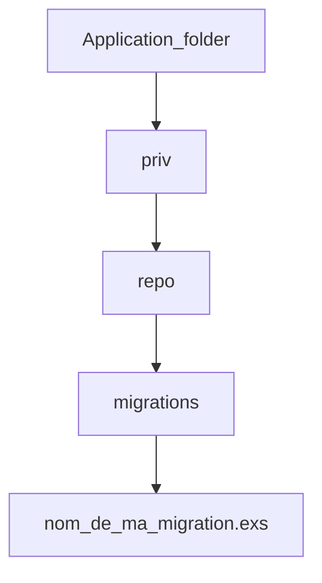

# Ecto notebook

## Migration

Pour la création d'une table, nous allons créér un fichier de migration

```elixir
mix(ecto.gen.migration(nom_de_ma_migration))
```

<!-- Learn more at https://mermaid-js.github.io/mermaid -->



<!-- livebook:{"break_markdown":true} -->

Editons le fichier de migration, en exemple nous allons créer une table :users

```elixir
defmodule Gestiup.Repo.Migrations.CreateUsersAuthTables do
  use Ecto.Migration

  # Création avec un id par défaut soit en big_int (1...n)
  def change do
    create table(:users, primary_key: false) do
      add(:id, :binary_id, primary_key: true)
      add(:email, :citext, null: false)
      add(:hashed_password, :string, null: false)
      add(:confirmed_at, :naive_datetime)
      timestamps()
    end
  end
end
```

```elixir
defmodule Gestiup.Repo.Migrations.CreateUsersAuthTables do
  use Ecto.Migration

  # Création avec un id défini, ici en binary_id (uuid)
  def change do
    create table(:users, primary_key: false) do
      add(:id, :binary_id, primary_key: true)
      add(:email, :citext, null: false)
      add(:hashed_password, :string, null: false)
      add(:confirmed_at, :naive_datetime)
      timestamps()
    end
  end
end
```


